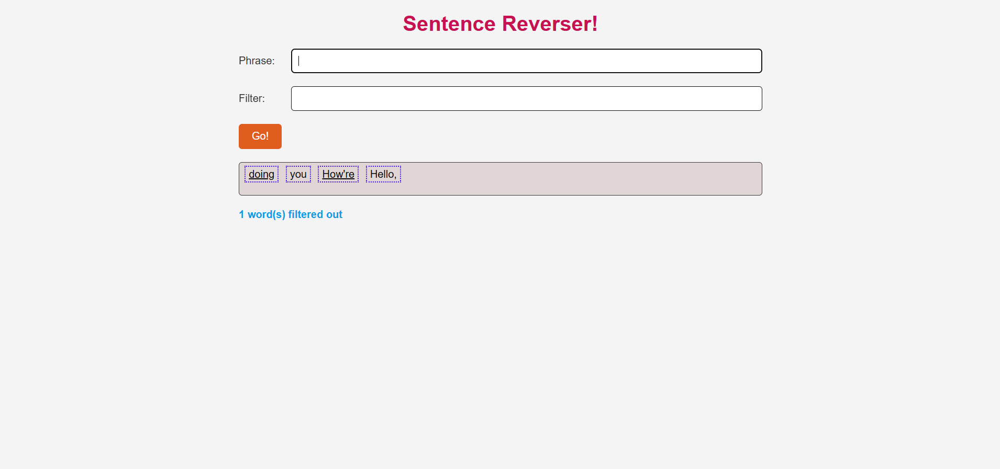

# Sentence Reverser  
)

## What Does This Project Do?

The ***Sentence Reverser*** allows the user to:
1. Input a phrase, and it reverses the order of the words.
2. Underline every other word (first, third, fifth, etc.) in the reversed phrase.
3. Optionally, filter out words that contain a specified substring (case-insensitive).
4. Display the count of words that were filtered out.
Each time the user clicks the "Go!" button, the previous results are cleared and new results are displayed.
---
## Languages Used

- HTML
- CSS
- JavaScript
---
## Screenshot of the output

